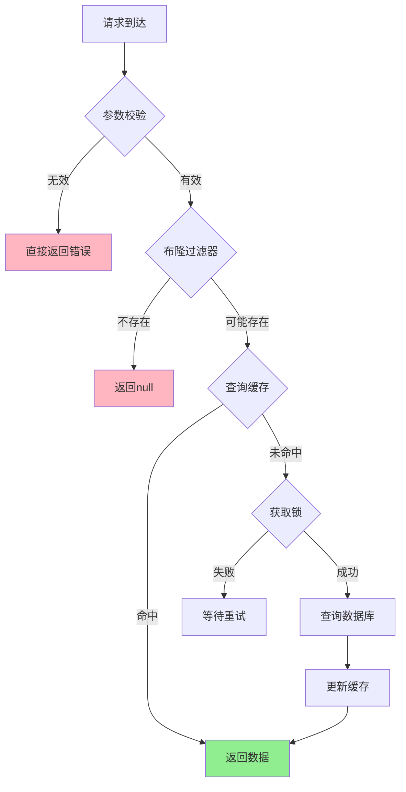

HUAW001：Redis 为什么快？
内存，避免磁盘IO瓶颈
单线程，避免上下文切换，CPU缓存友好（局部性）
数据结构： 简单动态字符串（SDS）、跳跃表、压缩列表
IO多路复用
协议简单轻量级 RESP，解析开销小。

TOUG003 ANTG004 LINGX008:  缓存血崩\缓存穿透
缓存雪崩 (Cache Avalanche)：大量缓存同时失效，导致请求直接打到数据库
原因：
1、集中过期
2、Redis 宕机
3、重启应用后清空所有缓存

解决：
1、随机过期时间TTL
2、多级缓存（应用本地缓存） *一致性？ 实现？
3、熔断降级（

缓存穿透 (Cache Penetration)
查询不存在的数据，缓存和数据库都没有，每次都要查数据库
原因：
数据不存在。可能是恶意。
数据库压力持续增大。

解决：
缓存空值，（设置较短过期时间。多短？）
布隆过滤器，（限于访存，判别存在）
参数校验，业务规则校验（排除无效的范围）

缓存击穿 (Cache Breakdown)
热点数据过期瞬间，大量并发请求同时查询数据库

原因：并发访问瞬间没缓存。
解决：
互斥锁（保护热点数据)* 为什么能？方案对比 （简单互斥锁|双重检查锁|异步更新|分布式锁+超市）
 - 互斥锁的方式防止击穿，会不会造成吞吐量下降
热点数据永不过期( 内存泄露|热点变化|更新更复杂(一致性）|重启无用)

## 📊 三种问题对比总结

| 问题类型 | 触发条件 | 影响范围 | 解决难度 | 危害程度 |
|---------|---------|---------|---------|---------|
| **缓存雪崩** | 大量缓存同时失效 | 整个系统 | ⭐⭐⭐ | 🔥🔥🔥🔥🔥 |
| **缓存穿透** | 查询不存在数据 | 特定查询 | ⭐⭐ | 🔥🔥🔥 |
| **缓存击穿** | 热点数据过期 | 单个热点 | ⭐⭐⭐⭐ | 🔥🔥🔥🔥 |

为什么要把缓存穿透和击穿，分开来说？我理解他们他是单点数据缓
存失效，属于一类问题
1、存在性根本差异
2、持续性差异：穿透是持续发生的，击穿是瞬时的
3、攻击向量差异：穿透容易被恶意攻击，击穿自然发生
4、解决方案针对性差异：穿透-防止无效查询，击穿-防止并发冲击。

## 🎯 最佳实践组合方案

TOUG004 : Redis\Redission如何实现分布式锁？
核心结论：Redisson通过Lua脚本保证原子性，看门狗机制自动续期，实现高可用分布式锁。
Redisson分布式锁的完整实现原理。它通过Lua脚本保证操作原子性，看门狗机制解决锁续期问题，pub/sub机制实现高效等待，是目前最成熟的Redis分布式锁解决方案.

为什么不应该直接使用set字符串当成信号量的方式，实现redis 锁，
比如
set lock='0' ttl=略大于transaction完成的时间
  trasaction
set lock='1'

简单SET方案存在致命的竞态条件和原子性问题，无法保证分布式锁的安全性。*思考。

时间间隙，两个线程都可能获得锁。

TOUG005: 公平锁、非公平锁

公平锁（Fair Lock） ：严格按照线程请求锁的时间顺序来分配锁，先到先得，保证FIFO（First In First Out）原则。

非公平锁（Unfair Lock） ：不保证线程获取锁的顺序，新来的线程可能会插队获得锁，即使有其他线程在等待队列中等待更长时间。

JDON002 你提到在接口里面加缓存提高性能，请问你怎么确认该缓存哪些数据？

数据特征分析（What to Cache） 统计频率
务场景评估（When to Cache） 业务一致性要求强弱，越弱越适合缓存
技术实现考量（How to Cache） 浏览器缓存、CDN缓存、应用层缓存、数据库缓存

JDON009 LINGX007 ALIJ005 Redis常用的数据结构有哪些？zset的底层数据结构是怎样的？如果放进zset的两个元素score相同，会发生什么？
edis五大基础数据结构 ：String、Hash、List、Set、ZSet，
其中ZSet使用跳跃表+哈希表双重结构，当score相同时按字典序排序。

ZSet 排序的实现原理：这是Redis中最复杂但也最精妙的数据结构设计之一。
ZSet排序实现原理 ：基于跳跃表(Skip List)的多层索引结构实现O(log N)有序存储，结合哈希表提供O(1)随机访问，通过score主排序+member字典序副排序保证元素唯一性和稳定排序。

> 跳表的主要竞争对手 ：红黑树、AVL树、B+树、Treap、LSM-Tree等平衡树结构，以及哈希表+数组的混合结构。每种数据结构在不同场景下都有各自的优势，选择取决于具体的性能需求和使用模式。

Redis选择跳表的核心原因
┌─────────────────────────────────────────┐
│ 1. 实现简单：相比红黑树，代码量少50%      │
│ 2. 并发友好：天然支持无锁并发访问        │
│ 3. 范围查询：O(log N + M)高效范围操作    │
│ 4. 内存效率：平均空间开销可控            │
│ 5. 调试友好：结构直观，易于理解和调试    │
│ 6. 性能稳定：概率平衡，期望性能好        │
└─────────────────────────────────────────┘
性能问题诊断能力对比
┌─────────────────────────────────────────┐
│              API调用者                   │
├─────────────────────────────────────────┤
│ 问题：ZSet查询慢                         │
│ 解决：增加缓存、升级硬件                  │
│ 结果：治标不治本，成本高                  │
├─────────────────────────────────────────┤
│              原理理解者                   │
├─────────────────────────────────────────┤
│ 问题：ZSet查询慢                         │
│ 分析：跳表层数不够、数据倾斜、热点访问    │
│ 解决：优化score设计、分片策略、预热机制   │
│ 结果：根本解决，成本低                   │
└─────────────────────────────────────────┘
架构设计思维对比
┌─────────────────────────────────────────┐
│ 需求：设计一个排行榜系统                  │
├─────────────────────────────────────────┤
│ API调用者思路：                          │
│ • 直接用ZSet存储所有用户分数              │
│ • 查询时直接ZRANGE                       │
│ • 遇到性能问题再想办法                    │
├─────────────────────────────────────────┤
│ 原理理解者思路：                          │
│ • 分析跳表特性，设计分层存储策略          │
│ • 考虑score分布，避免数据倾斜             │
│ • 设计分片策略，支持水平扩展              │
│ • 预估内存使用，规划容量                  │
│ • 设计降级方案，保证可用性                │
└─────────────────────────────────────────┘

生产问题排查能力对比
┌─────────────────────────────────────────┐
│ 问题：Redis内存使用异常增长               │
├─────────────────────────────────────────┤
│ API调用者：                              │
│ • 重启Redis                              │
│ • 增加内存                               │
│ • 清空所有数据                           │
├─────────────────────────────────────────┤
│ 原理理解者：                              │
│ • 分析ZSet内存结构                       │
│ • 检查跳表层数分布                       │
│ • 识别数据倾斜问题                       │
│ • 优化score设计                          │
│ • 实施渐进式清理                         │
└─────────────────────────────────────────┘

PDDO002 缓存设计，活动结束时如何管理缓存？
采用分层清理+渐进式失效+兜底机制的组合方案，确保数据一致性的同时避免缓存雪崩，保障用户体验平滑过渡。

ALIJ004 简单说说Redis在我们项目里面的适用场景，比如智能客服后管系统、CRM后管系统
性能瓶颈 → Redis缓存 → 响应速度提升
数据共享 → Redis存储 → 多服务协同
实时性需求 → Redis发布订阅 → 即时通知