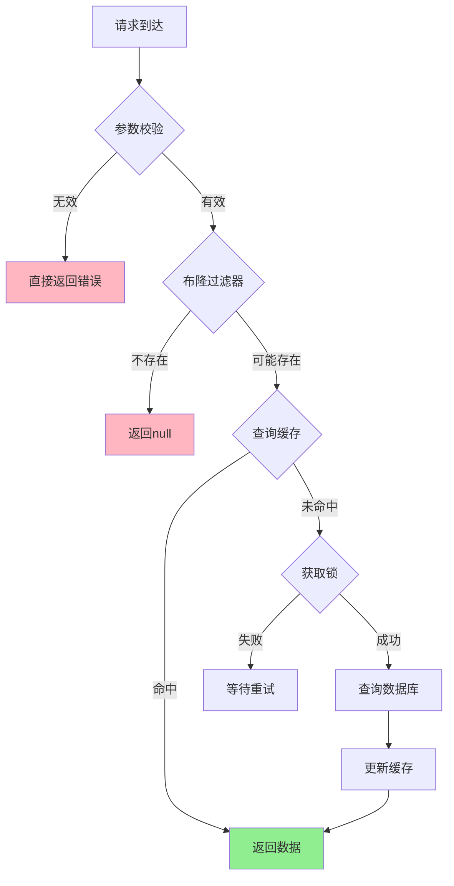

HUAW001：Redis 为什么快？
内存，避免磁盘IO瓶颈
单线程，避免上下文切换，CPU缓存友好（局部性）
数据结构： 简单动态字符串（SDS）、跳跃表、压缩列表
IO多路复用
协议简单轻量级 RESP，解析开销小。

TOUG003:  缓存血崩\缓存穿透
缓存雪崩 (Cache Avalanche)：大量缓存同时失效，导致请求直接打到数据库
原因：
1、集中过期
2、Redis 宕机
3、重启应用后清空所有缓存

解决：
1、随机过期时间TTL
2、多级缓存（应用本地缓存） *一致性？ 实现？
3、熔断降级（

缓存穿透 (Cache Penetration)
查询不存在的数据，缓存和数据库都没有，每次都要查数据库
原因：
数据不存在。可能是恶意。
数据库压力持续增大。

解决：
缓存空值，（设置较短过期时间。多短？）
布隆过滤器，（限于访存，判别存在）
参数校验，业务规则校验（排除无效的范围）

缓存击穿 (Cache Breakdown)
热点数据过期瞬间，大量并发请求同时查询数据库

原因：并发访问瞬间没缓存。
解决：
互斥锁（保护热点数据)* 为什么能？方案对比 （简单互斥锁|双重检查锁|异步更新|分布式锁+超市）
 - 互斥锁的方式防止击穿，会不会造成吞吐量下降
热点数据永不过期( 内存泄露|热点变化|更新更复杂(一致性）|重启无用)

## 📊 三种问题对比总结

| 问题类型 | 触发条件 | 影响范围 | 解决难度 | 危害程度 |
|---------|---------|---------|---------|---------|
| **缓存雪崩** | 大量缓存同时失效 | 整个系统 | ⭐⭐⭐ | 🔥🔥🔥🔥🔥 |
| **缓存穿透** | 查询不存在数据 | 特定查询 | ⭐⭐ | 🔥🔥🔥 |
| **缓存击穿** | 热点数据过期 | 单个热点 | ⭐⭐⭐⭐ | 🔥🔥🔥🔥 |

为什么要把缓存穿透和击穿，分开来说？我理解他们他是单点数据缓
存失效，属于一类问题
1、存在性根本差异
2、持续性差异：穿透是持续发生的，击穿是瞬时的
3、攻击向量差异：穿透容易被恶意攻击，击穿自然发生
4、解决方案针对性差异：穿透-防止无效查询，击穿-防止并发冲击。

## 🎯 最佳实践组合方案

TOUG004 : Redis\Redission如何实现分布式锁？
核心结论：Redisson通过Lua脚本保证原子性，看门狗机制自动续期，实现高可用分布式锁。
Redisson分布式锁的完整实现原理。它通过Lua脚本保证操作原子性，看门狗机制解决锁续期问题，pub/sub机制实现高效等待，是目前最成熟的Redis分布式锁解决方案.

为什么不应该直接使用set字符串当成信号量的方式，实现redis 锁，
比如
set lock='0' ttl=略大于transaction完成的时间
  trasaction
set lock='1'

简单SET方案存在致命的竞态条件和原子性问题，无法保证分布式锁的安全性。*思考。

时间间隙，两个线程都可能获得锁。