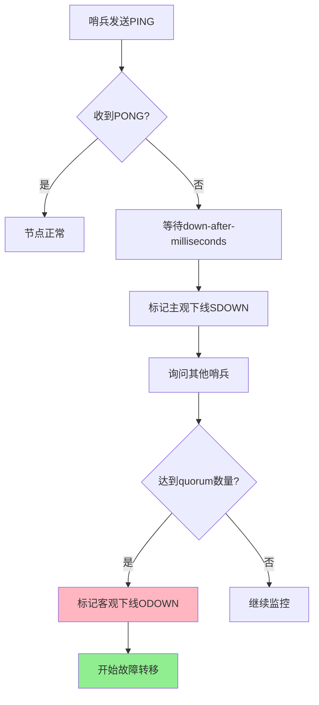

```mermaid
graph TB
    A[哨兵发送PING] --> B{收到PONG?}
    B -->|是| C[节点正常]
    B -->|否| D[等待down-after-milliseconds]
    D --> E[标记主观下线SDOWN]
    E --> F[询问其他哨兵]
    F --> G{达到quorum数量?}
    G -->|是| H[标记客观下线ODOWN]
    G -->|否| I[继续监控]
    H --> J[开始故障转移]
    
    style H fill:#FFB6C1
    style J fill:#90EE90
```