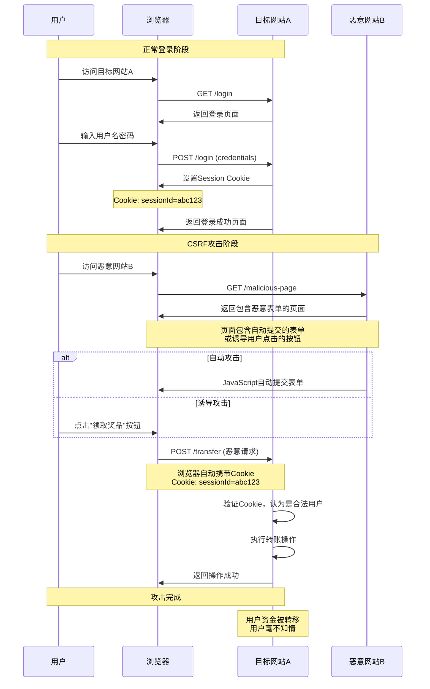
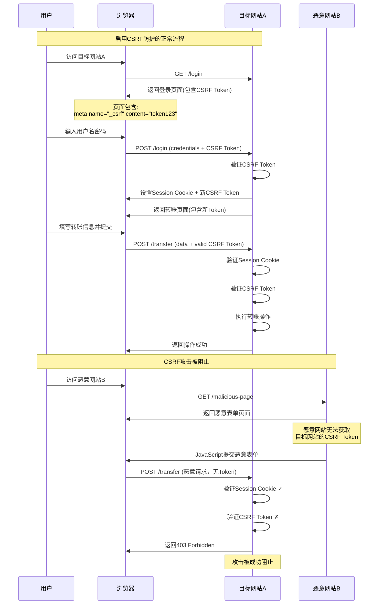

# CSRF攻击详解

## 什么是CSRF攻击？

CSRF（Cross-Site Request Forgery，跨站请求伪造）是一种网络攻击方式，攻击者诱导受害者在已认证的Web应用程序上执行非预期的操作。

## CSRF攻击原理

### 攻击流程时序图



### 攻击流程详解
1. 用户登录受信任的网站A，并在本地生成Cookie
2. 在不登出网站A的情况下，访问危险网站B
3. 网站B向网站A发送请求，浏览器会默认携带网站A的Cookie
4. 网站A收到请求后，无法判断请求来源，误以为是用户的合法操作
5. 攻击成功，执行了用户非预期的操作

### 攻击条件
- 用户已在目标网站登录并保持会话
- 攻击者了解目标网站的请求格式
- 目标网站仅依赖Cookie进行身份验证

## CSRF攻击示例

### 银行转账示例
```html
<!-- 恶意网站B的页面 -->
<form action="https://bank.com/transfer" method="POST">
  <input type="hidden" name="to" value="attacker_account">
  <input type="hidden" name="amount" value="10000">
  <input type="submit" value="点击领取奖品">
</form>

<!-- 或者使用JavaScript自动提交 -->
<script>
  document.forms[0].submit();
</script>
```

### GET请求攻击
```html
<!-- 通过图片标签触发GET请求 -->

```

## CSRF防护措施

### 防护机制时序图



### 1. CSRF Token
```java
// Spring Security中的CSRF Token示例
@PostMapping("/transfer")
public String transfer(@RequestParam String to, 
                      @RequestParam String amount,
                      HttpServletRequest request) {
    // 验证CSRF Token
    String token = request.getParameter("_csrf");
    if (!csrfTokenRepository.validateToken(token)) {
        throw new SecurityException("Invalid CSRF token");
    }
    // 执行转账逻辑
    return "success";
}
```

### 2. 验证Referer头
```java
@PostMapping("/transfer")
public String transfer(HttpServletRequest request) {
    String referer = request.getHeader("Referer");
    if (referer == null || !referer.startsWith("https://bank.com")) {
        throw new SecurityException("Invalid referer");
    }
    // 执行业务逻辑
    return "success";
}
```

### 3. 双重Cookie验证
```javascript
// 前端设置CSRF Cookie
document.cookie = "csrf-token=" + generateRandomToken();

// 发送请求时在Header中携带相同的token
fetch('/api/transfer', {
  method: 'POST',
  headers: {
    'X-CSRF-Token': getCookieValue('csrf-token'),
    'Content-Type': 'application/json'
  },
  body: JSON.stringify({to: 'account', amount: 100})
});
```

### 4. SameSite Cookie属性
```java
// 设置Cookie的SameSite属性
Cookie cookie = new Cookie("sessionId", sessionId);
cookie.setSameSite(Cookie.SameSite.STRICT); // 或 LAX
response.addCookie(cookie);
```

## Spring Security CSRF防护配置

```java
@Configuration
@EnableWebSecurity
public class SecurityConfig {
    
    @Bean
    public SecurityFilterChain filterChain(HttpSecurity http) throws Exception {
        http
            .csrf(csrf -> csrf
                .csrfTokenRepository(CookieCsrfTokenRepository.withHttpOnlyFalse())
                .ignoringRequestMatchers("/api/public/**") // 忽略公开API
            )
            .sessionManagement(session -> session
                .sessionCreationPolicy(SessionCreationPolicy.IF_REQUIRED)
            );
        return http.build();
    }
}
```

## 前端CSRF Token处理

### Thymeleaf模板
```html
<form th:action="@{/transfer}" method="post">
    <input type="hidden" th:name="${_csrf.parameterName}" th:value="${_csrf.token}"/>
    <input type="text" name="to" placeholder="收款账户">
    <input type="number" name="amount" placeholder="金额">
    <button type="submit">转账</button>
</form>
```

### Ajax请求
```javascript
// 获取CSRF Token
const token = document.querySelector('meta[name="_csrf"]').getAttribute('content');
const header = document.querySelector('meta[name="_csrf_header"]').getAttribute('content');

// 发送Ajax请求
$.ajaxSetup({
    beforeSend: function(xhr) {
        xhr.setRequestHeader(header, token);
    }
});
```

## CSRF vs XSS

| 特征 | CSRF | XSS |
|------|------|-----|
| 攻击目标 | 利用用户身份执行操作 | 窃取用户信息或控制页面 |
| 攻击方式 | 跨站请求伪造 | 注入恶意脚本 |
| 防护重点 | 验证请求来源 | 输入验证和输出编码 |
| 影响范围 | 特定操作 | 整个会话 |

## 最佳实践

1. **启用CSRF保护**：在所有状态改变的操作中启用CSRF保护
2. **使用POST请求**：重要操作使用POST而非GET请求
3. **验证Referer**：检查请求来源的合法性
4. **短会话超时**：减少攻击窗口期
5. **用户确认**：重要操作要求用户二次确认
6. **SameSite Cookie**：设置适当的SameSite属性

## 总结

CSRF攻击利用了Web应用程序对用户浏览器的信任，通过多层防护措施可以有效防范此类攻击。在实际开发中，应该根据应用的安全需求选择合适的防护策略。