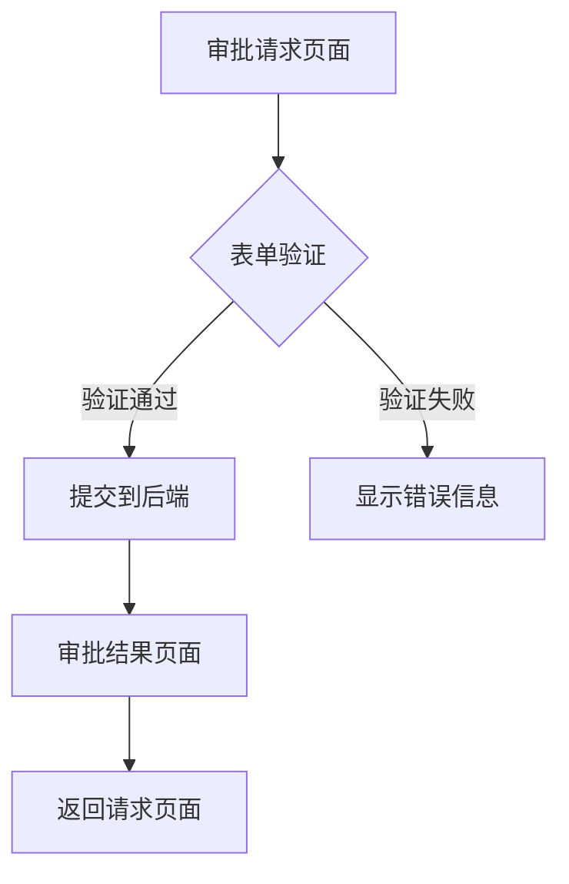

## 1. 产品概述

这是一个基于React + TypeScript的审批系统前端MVP，用于客户验收演示。用户可以通过Web页面提交审批请求（金额和用途），并查看审批结果。

## 2. 核心功能

### 2.1 用户角色

| 角色   | 注册方式 | 核心权限          |
| ---- | ---- | ------------- |
| 普通用户 | 无需注册 | 提交审批请求、查看审批结果 |

### 2.2 功能模块

审批系统MVP包含以下核心页面：

1. **审批请求页面**：审批表单、金额输入、用途说明
2. **审批结果页面**：结果显示、状态展示、返回按钮

### 2.3 页面详情

| 页面名称   | 模块名称 | 功能描述                        |
| ------ | ---- | --------------------------- |
| 审批请求页面 | 审批表单 | 输入审批金额（必填）、填写用途说明（必填）、提交按钮  |
| 审批请求页面 | 表单验证 | 金额格式验证、用途长度验证、必填项检查         |
| 审批结果页面 | 结果展示 | 显示审批状态（通过/拒绝）、显示审批意见、显示请求详情 |
| 审批结果页面 | 导航按钮 | 返回首页按钮、重新提交按钮               |

## 3. 核心流程

用户操作流程：

1. 用户访问审批请求页面
2. 填写审批金额和用途说明
3. 点击提交按钮发送请求到后端
4. 跳转到审批结果页面显示审批状态
5. 用户可选择返回重新提交

## 4. 用户界面设计

### 4.1 设计风格

* **主色调**：蓝色系（#1890ff）体现专业性

* **按钮样式**：圆角矩形，主按钮使用主色调

* **字体**：系统默认字体，标题16px，正文14px

* **布局风格**：居中卡片式布局，响应式设计

* **图标风格**：使用简洁的线性图标

### 4.2 页面设计概述

| 页面名称   | 模块名称 | UI元素                               |
| ------ | ---- | ---------------------------------- |
| 审批请求页面 | 审批表单 | 居中卡片布局，白色背景，蓝色标题，输入框带边框，提交按钮居中显示   |
| 审批结果页面 | 结果展示 | 大图标显示状态（绿色勾/红色叉），状态文字加粗显示，详情信息灰色背景 |

### 4.3 响应式设计

采用桌面端优先设计，适配平板和手机端。在移动端自动调整表单宽度和字体大小，确保良好的触摸体验。

## 5. 技术集成要求

* 后端服务地址：<http://localhost:8089>

* API接口：RESTful风格

* 数据格式：JSON

* 错误处理：统一错误提示

* 加载状态：提交时显示加载动画

