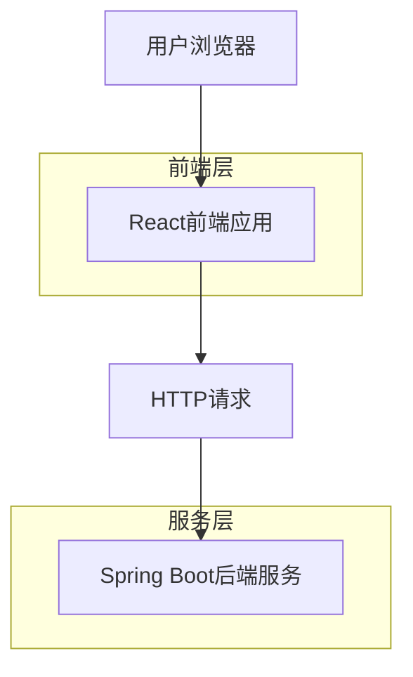
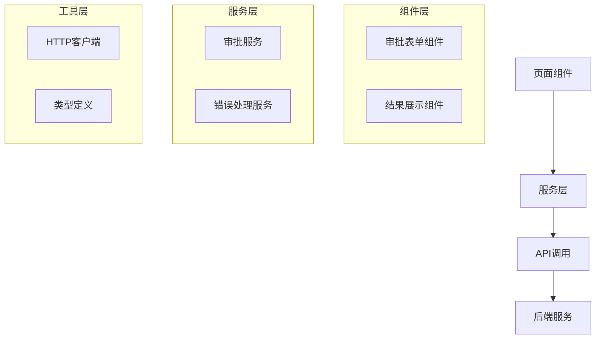

## 1. 架构设计



## 2. 技术栈描述

- **前端**: React@18 + TypeScript@5 + Vite
- **初始化工具**: vite-init
- **UI框架**: Ant Design@5
- **HTTP客户端**: Axios
- **状态管理**: React Hooks
- **表单验证**: Ant Design Form
- **后端**: Spring Boot（独立部署）

## 3. 路由定义

| 路由 | 用途 |
|-------|---------|
| / | 审批请求页面，显示审批表单 |
| /result | 审批结果页面，显示审批状态和详情 |

## 4. API接口定义

### 4.1 审批相关API

**提交审批请求**
```
POST http://localhost:8089/api/approval/submit
```

请求参数：
| 参数名 | 参数类型 | 是否必需 | 描述 |
|-----------|-------------|-------------|-------------|
| amount | number | true | 审批金额，必须大于0 |
| purpose | string | true | 用途说明，长度限制200字符 |

响应参数：
| 参数名 | 参数类型 | 描述 |
|-----------|-------------|-------------|
| success | boolean | 请求是否成功 |
| approvalId | string | 审批记录ID |
| status | string | 审批状态（approved/rejected） |
| message | string | 审批意见或错误信息 |

请求示例：
```json
{
  "amount": 1000,
  "purpose": "采购办公用品"
}
```

响应示例：
```json
{
  "success": true,
  "approvalId": "123e4567-e89b-12d3-a456-426614174000",
  "status": "approved",
  "message": "审批通过，请按流程执行"
}
```

## 5. 前端架构设计



## 6. 数据模型定义

### 6.1 TypeScript类型定义

审批请求类型：
```typescript
interface ApprovalRequest {
  amount: number;
  purpose: string;
}
```

审批响应类型：
```typescript
interface ApprovalResponse {
  success: boolean;
  approvalId?: string;
  status?: 'approved' | 'rejected';
  message?: string;
}
```

### 6.2 组件状态定义

表单状态：
```typescript
interface FormState {
  amount: number;
  purpose: string;
  loading: boolean;
  error: string | null;
}
```

结果状态：
```typescript
interface ResultState {
  approvalId: string;
  status: 'approved' | 'rejected';
  message: string;
  amount: number;
  purpose: string;
}
```

## 7. 错误处理策略

- **网络错误**: 显示友好的网络连接错误提示
- **验证错误**: 在表单字段下方显示具体错误信息
- **服务器错误**: 显示通用的服务器错误提示，记录错误日志
- **超时处理**: 设置30秒请求超时，显示超时提示

## 8. 性能优化

- **代码分割**: 使用React.lazy进行路由级别的代码分割
- **防抖处理**: 表单提交按钮添加防抖，避免重复提交
- **缓存策略**: 适当缓存静态资源和API响应
- **加载状态**: 提交请求时显示加载动画，提升用户体验