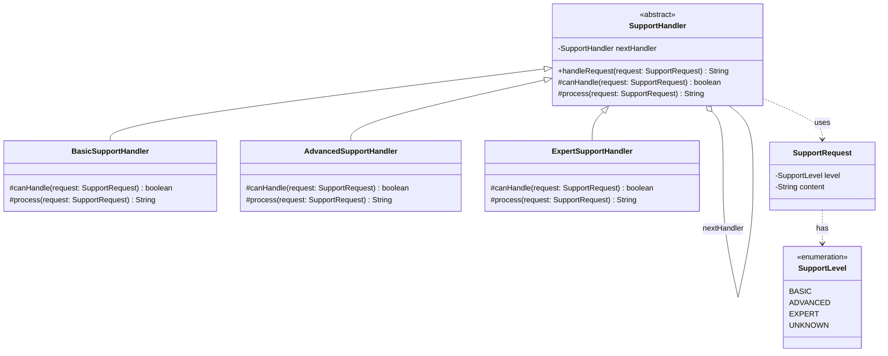
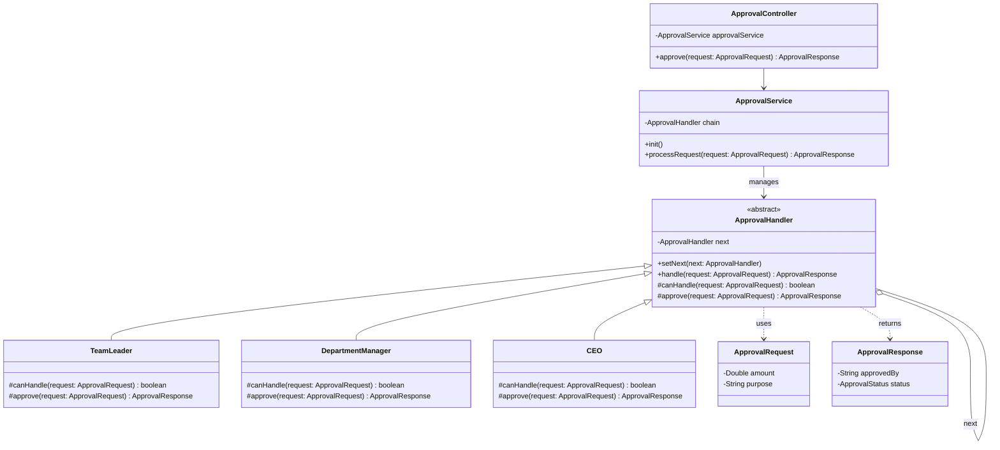

# Class Diagrams

## 1. Standard Java Chain of Responsibility

```mermaid
classDiagram
    class SupportHandler {
        <<abstract>>
        -SupportHandler nextHandler
        +handleRequest(request: SupportRequest) String
        #canHandle(request: SupportRequest) boolean
        #process(request: SupportRequest) String
    }

    class BasicSupportHandler {
        #canHandle(request: SupportRequest) boolean
        #process(request: SupportRequest) String
    }

    class AdvancedSupportHandler {
        #canHandle(request: SupportRequest) boolean
        #process(request: SupportRequest) String
    }

    class ExpertSupportHandler {
        #canHandle(request: SupportRequest) boolean
        #process(request: SupportRequest) String
    }

    class SupportRequest {
        -SupportLevel level
        -String content
    }

    class SupportLevel {
        <<enumeration>>
        BASIC
        ADVANCED
        EXPERT
        UNKNOWN
    }

    SupportHandler <|-- BasicSupportHandler
    SupportHandler <|-- AdvancedSupportHandler
    SupportHandler <|-- ExpertSupportHandler
    SupportHandler o-- SupportHandler : nextHandler
    SupportHandler ..> SupportRequest : uses
    SupportRequest ..> SupportLevel : has
```

## 2. Spring Boot Approval Chain

```mermaid
classDiagram
    class ApprovalController {
        -ApprovalService approvalService
        +approve(request: ApprovalRequest) ApprovalResponse
    }

    class ApprovalService {
        -ApprovalHandler chain
        +init()
        +processRequest(request: ApprovalRequest) ApprovalResponse
    }

    class ApprovalHandler {
        <<abstract>>
        -ApprovalHandler next
        +setNext(next: ApprovalHandler)
        +handle(request: ApprovalRequest) ApprovalResponse
        #canHandle(request: ApprovalRequest) boolean
        #approve(request: ApprovalRequest) ApprovalResponse
    }

    class TeamLeader {
        #canHandle(request: ApprovalRequest) boolean
        #approve(request: ApprovalRequest) ApprovalResponse
    }

    class DepartmentManager {
        #canHandle(request: ApprovalRequest) boolean
        #approve(request: ApprovalRequest) ApprovalResponse
    }

    class CEO {
        #canHandle(request: ApprovalRequest) boolean
        #approve(request: ApprovalRequest) ApprovalResponse
    }

    class ApprovalRequest {
        -Double amount
        -String purpose
    }

    class ApprovalResponse {
        -String approvedBy
        -ApprovalStatus status
    }

    ApprovalController --> ApprovalService
    ApprovalService --> ApprovalHandler : manages
    ApprovalHandler <|-- TeamLeader
    ApprovalHandler <|-- DepartmentManager
    ApprovalHandler <|-- CEO
    ApprovalHandler o-- ApprovalHandler : next
    ApprovalHandler ..> ApprovalRequest : uses
    ApprovalHandler ..> ApprovalResponse : returns
```
